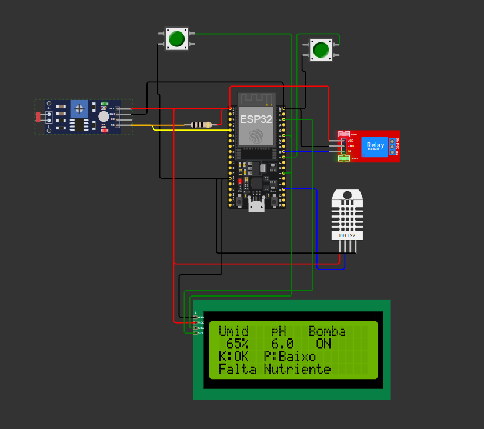

## FarmTech Solutions – Sistema de Irrigação Inteligente

### 👨‍🎓 Integrantes

* Pedro Henrique Zani  
* Flavia Nunes Bocchino  
* Felipe Menezes  

---

## 📜 Descrição

Projeto acadêmico que simula um sistema de irrigação inteligente utilizando ESP32, sensores de umidade, nutrientes (fósforo e potássio) e pH, **FarmTech Solutions**. O sistema decide o acionamento da bomba d'água conforme as leituras dos sensores, armazenando os dados em banco e oferecendo um dashboard interativo.

Nesta **Fase 4** o projeto foi estendido com:

* Integração de um display LCD I2C para exibição local das métricas.
* Modelo preditivo em Scikit-learn para sugerir ações de irrigação.
* Dashboard em Streamlit para visualização em tempo real.
* Serial Plotter no Wokwi para monitoramento gráfico.
* Otimizações de memória no código C++ do ESP32.

---

## 📁 Estrutura de Pastas (templateFiap)

* **src/** – Código-fonte (ESP32, Python, etc.)  
* **assets/** – Imagens, prints, vídeos, diagramas  
* **document/** – Documentação complementar  
* **scripts/** – Scripts auxiliares (backup, deploy, DB)  
* **config/** – Arquivos de configuração
* **README.md** – Este guia do projeto

---

## 🔧 Como Executar o Projeto
## ☑️ Menu de Execução (CLI)

1. Instale dependências Python: `pip install -r requirements.txt`
Todos os utilitários Python estão centralizados em `src/menu.py`.  Execute:

```bash
python src/menu.py
```

Você verá o menu interativo:

```
1) Gerar dados sintéticos
2) Treinar modelo preditivo
3) Ver estatísticas do banco
4) Adicionar leitura manual
5) Excluir leitura por ID
6) Listar últimas 10 leituras
7) Abrir dashboard Streamlit
8) Abrir Wokwi (diagram.json)
9) Excluir TODAS as leituras
0) Sair
```

Funções principais:

1. **Gerar dados sintéticos** – Popular o banco SQLite com *N* leituras aleatórias (umidade, pH, temperatura, presença de nutrientes).  Útil para testes rápidos.
2. **Treinar modelo preditivo** – Carrega os dados atuais, treina o modelo Scikit-learn  e salva em `src/irrigation_model.joblib`.
3. **Ver estatísticas** – Exibe médias, mín/max e variação de umidade, pH e temperatura, além do % de bomba ligada e ausência de nutrientes.
4. **Adicionar leitura manual** – Permite digitar uma leitura; o sistema calcula automaticamente se a bomba deveria ligar e o motivo.
5. **Excluir leitura por ID** – Remove um registro específico.
6. **Listar últimas 10 leituras** – Dump rápido para conferência.
7. **Abrir dashboard Streamlit** – Abre o dashboard em uma nova janela de terminal (Windows) ou em background (Unix).
8. **Abrir Wokwi** – Abre o `diagram.json` no VS Code.
9. **Excluir TODAS as leituras** – Limpa completamente a tabela `leituras`.

---

## 🗃 Histórico de Lançamentos (tags)

* 0.4.0 – Fase 4 – Dashboard, ML, LCD, otimizações  
* 0.3.0 – Fase 3 – Integração ESP32 + DB
* 0.2.0 – Fase 2 – MER e banco de dados  
* 0.1.0 – Fase 1 – Projeto Inicial

---
## Vídeo do projeto: [Youtube](https://www.youtube.com/watch?v=clRI9BjdPls)

## Componentes Simulados

- **Fósforo (P):** Botão físico (pressionado = presença)
- **Potássio (K):** Botão físico (pressionado = presença)
- **pH:** Sensor LDR (valores analógicos simulam pH de 0 a 14)
- **Umidade do solo:** Sensor DHT22
- **Bomba d'água:** Relé
- **Status:** LED onboard

## Circuito




## 🚀 Melhorias da Fase 4

Nesta fase adicionamos:

1. **Display LCD I2C (ESP32)** – Métricas em tempo real em 16×2.
2. **Serial Plotter** – Monitoramento da umidade: abra o *Serial Plotter* no VS Code (`Ctrl+Shift+L`).
3. **Otimização de memória** – Uso de `uint16_t`, redução de floats e comentários no código.
4. **Modelo preditivo (Scikit-learn)** – Classifica quando irrigar baseado em umidade e pH.
5. **Dashboard Streamlit** – KPIs, gráficos e previsão interativa em `src/dashboard.py`.

### Como rodar o Streamlit manualmente (opcional)
Se preferir iniciar fora do menu:

```bash
streamlit run src/dashboard/dashboard.py
```

### Populando o banco com dados de exemplo
```bash
python scripts/generate_sample_data.py 300   # cria/atualiza dados_irrigacao.db
python src/model.py                           # treina e salva o modelo
```
As métricas de acurácia aparecerão no console.

### Prints
1. **LCD no Wokwi** – `assets/lcd_wokwi.png`
2. **Serial Plotter** – `assets/serial_plotter.png`
3. **Dashboard Streamlit** – `assets/dashboard.png`


---

## 📊 Dashboard Streamlit em detalhe

O dashboard disponibilizado em `src/dashboard.py` oferece:

* **Menu lateral** com seleção de visão:
  * *Dashboard* – mostra KPIs e gráficos.
  * *Dados brutos* – tabela com as últimas 500 leituras.
* **Filtro de intervalo de datas** – escolha um período para analisar.
* **Métricas rápidas** – Leituras totais, umidade média e percentual de acionamento da bomba.
* **Gráficos de linha** – variação temporal da umidade, temperatura e pH do solo.
* **Probabilidade de irrigação por horário** – cálculo da frequência de acionamento da bomba em cada hora do dia.
* **Horários sugeridos** – destaca os horários cujo histórico indica probabilidade de irrigação.
* **Previsão ad-hoc** – insira umidade, pH e presença de nutrientes para saber se é recomendável irrigar naquele momento.

> Dica: ao abrir o Streamlit, atualize os sliders/checkboxes e clique em **📊 Prever** para testar cenários.


---

## 📋 Licença

Este projeto está licenciado sob a licença **MIT** – consulte o arquivo `LICENSE` para mais detalhes.

---
